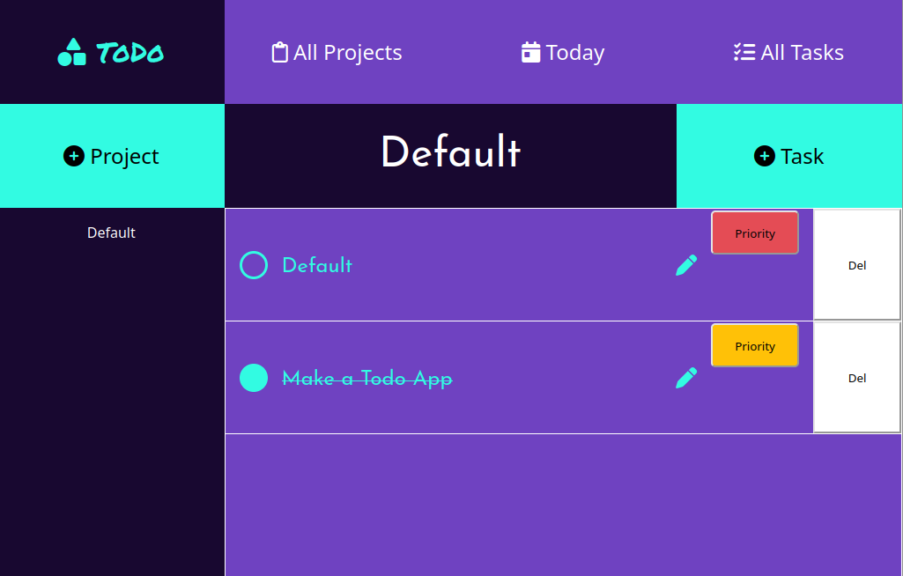

Todo

============

A mobile responsive Todo App written in Vanilla Javascript

---

## Features
- Projects and tasks are persisted and stored in Firebase
- Can perform all CRUD operations on tasks and projects
- Can view Today's tasks / All Tasks / All Projects
- Can view tasks grouped by Project
- Color coded task priority
- Task completion strikethrough indicator
- Click outside modal
## Built With
- Vanilla Javascript
- SCSS
- Firebase
- Webpack
## Concepts
- Async/Await
- ES6 Modules
- Factory Functions
- IIFEs
- Callback functions
- SCSS Variables
- Using Pseudoclasses for Icons
- CSS Grid
---

